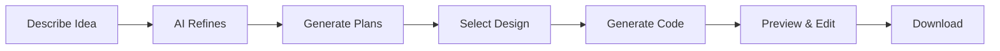

<div align="center">

# 🎙️ VOCODE

### AI-Powered Voice Website Builder

*Transform your ideas into production-ready websites using just your voice*

[](https://reactjs.org/)
[](https://nodejs.org/)
[](LICENSE)

[Features](#-features) • [Tech Stack](#-tech-stack) • [Getting Started](#-getting-started) • [Usage](#-usage) • [Documentation](#-documentation)

</div>

---

## 🌟 Overview

VOCODE revolutionizes web development by enabling anyone to create professional websites through natural language. Simply describe your vision using voice or text, and watch as AI transforms it into a fully functional, responsive website in seconds.

## ✨ Features

<table>
<tr>
<td width="50%">

### 🎤 Voice & Text Input
Describe your website naturally using voice commands or text. Our intelligent system understands your vision and translates it into structured requirements.

### 🎨 Multiple Design Options
Receive three unique, professionally designed website plans tailored to your needs. Choose the one that best matches your vision.

</td>
<td width="50%">

### ⚡ Instant Generation
Generate complete, production-ready React websites in seconds. No coding knowledge required.

### ✏️ Natural Language Editing
Make changes to your website using simple commands like "make the header blue" or "add a contact form."

</td>
</tr>
<tr>
<td width="50%">

### 👁️ Live Preview
See your website come to life in real-time with an interactive preview that updates instantly as you make changes.

</td>
<td width="50%">

### 📦 Export & Deploy
Download your complete website project as a ready-to-deploy package with all dependencies included.

</td>
</tr>
</table>

## 🛠️ Tech Stack

### Frontend
```
React 18          Modern UI framework
Vite              Lightning-fast build tool
Tailwind CSS      Utility-first styling
Framer Motion     Smooth animations
Spline 3D         Interactive 3D graphics
OGL               WebGL rendering
```

### Backend
```
Node.js           Server runtime
Express           Web framework
```

## 🚀 Getting Started

### Prerequisites

- **Node.js** 18 or higher
- **npm** or **yarn** package manager

### Installation

1. **Clone the repository**
   ```bash
   git clone <repository-url>
   cd vocode
   ```

2. **Install dependencies**
   ```bash
   npm install
   ```

3. **Set up environment**
   ```bash
   cp .env.example .env
   ```
   
   Configure your `.env` file with the required variables.

### Running the Application

**Development Mode** (Recommended)
```bash
npm run dev:all
```

This starts both frontend (`http://localhost:3000`) and backend (`http://localhost:5000`) servers.

**Individual Services**
```bash
# Frontend only
npm run dev

# Backend only
npm run server
```

**Production Build**
```bash
npm run build
npm run preview
```

## 📁 Project Structure

```
vocode/
├── src/
│   ├── components/          # React components
│   │   ├── MainPage.jsx
│   │   ├── HowItWorksPage.jsx
│   │   ├── EditorPage.jsx
│   │   └── ui/              # Reusable UI components
│   ├── services/            # API integration
│   ├── hooks/               # Custom React hooks
│   ├── lib/                 # Utility functions
│   └── App.jsx
├── index.js                 # Backend server
└── package.json
```

## 📖 Usage

### Step-by-Step Workflow



1. **Describe Your Vision**
   - Use voice or text to describe your website idea
   - Be as detailed or as brief as you like

2. **Review Design Plans**
   - Receive three unique design options
   - Each plan tailored to your requirements

3. **Generate Your Website**
   - Select your preferred design
   - AI generates complete React code instantly

4. **Customize & Preview**
   - Make changes using natural language
   - See updates in real-time

5. **Export Your Project**
   - Download as a complete, ready-to-deploy package
   - Includes all dependencies and configuration

## 🎯 Key Capabilities

### Voice Recognition
- **Web Speech API** integration for seamless voice input
- Real-time transcription with high accuracy
- Automatic fallback to text input

### AI-Powered Generation
- Natural language understanding
- Context-aware code generation
- Responsive, modern design patterns
- Production-ready output

### Live Editing
- Natural language edit commands
- Contextual understanding of changes
- Instant preview updates
- Maintains code quality and structure

## 🔧 Configuration

### Environment Variables

| Variable | Description | Default |
|----------|-------------|---------|
| `VITE_API_URL` | Backend API endpoint | `http://localhost:5000` |
| `PORT` | Backend server port | `5000` |

## 🐛 Troubleshooting

<details>
<summary><b>Server Issues</b></summary>

- Ensure port 5000 is available
- Verify Node.js version (18+ required)
- Check environment variables are set correctly
</details>

<details>
<summary><b>Frontend Connection Issues</b></summary>

- Verify `VITE_API_URL` in `.env`
- Confirm backend server is running
- Check browser console for errors
</details>

<details>
<summary><b>Voice Recognition Not Working</b></summary>

- Use Chrome or Edge browser (best support)
- Grant microphone permissions
- HTTPS required for production environments
</details>

## 🗺️ Roadmap

- [ ] Multi-model AI support
- [ ] Pre-built template library
- [ ] Collaborative editing features
- [ ] Version control & history
- [ ] One-click deployment
- [ ] Custom domain integration
- [ ] Built-in SEO tools
- [ ] Analytics dashboard

## 🤝 Contributing

We welcome contributions! Here's how you can help:

1. **Fork** the repository
2. **Create** a feature branch (`git checkout -b feature/amazing-feature`)
3. **Commit** your changes (`git commit -m 'Add amazing feature'`)
4. **Push** to the branch (`git push origin feature/amazing-feature`)
5. **Open** a Pull Request

## 📄 License

This project is licensed under the MIT License - see the [LICENSE](LICENSE) file for details.

## 💬 Support

Need help? Here's how to get support:

- 📖 Check the [Documentation](#-documentation)
- 🐛 [Open an issue](../../issues) for bug reports
- 💡 [Start a discussion](../../discussions) for questions
- 🔍 Review the [Troubleshooting](#-troubleshooting) section

---

<div align="center">

**Built with ❤️ using React, Node.js, and AI**

[⬆ Back to Top](#-vocode)

</div>
